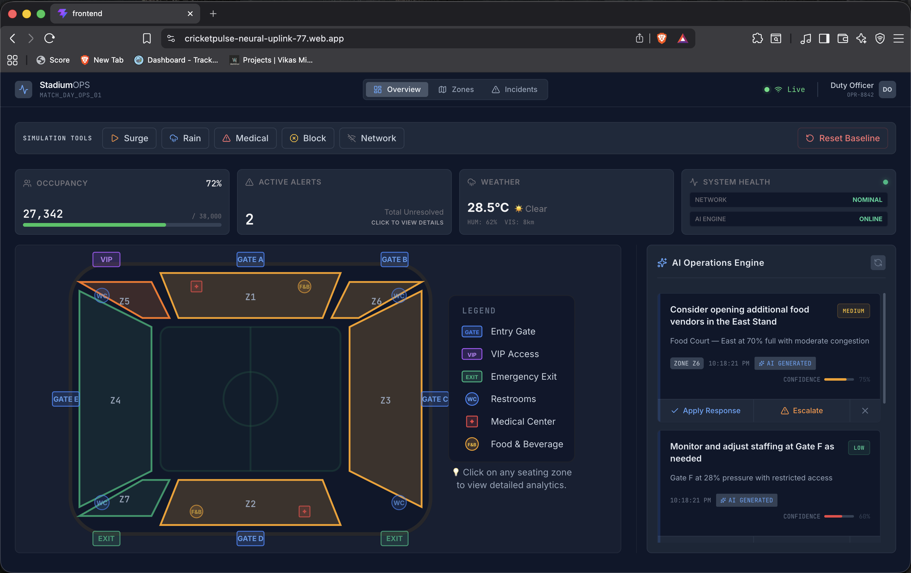
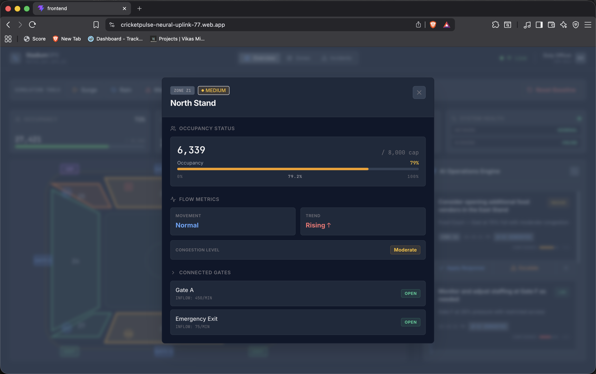
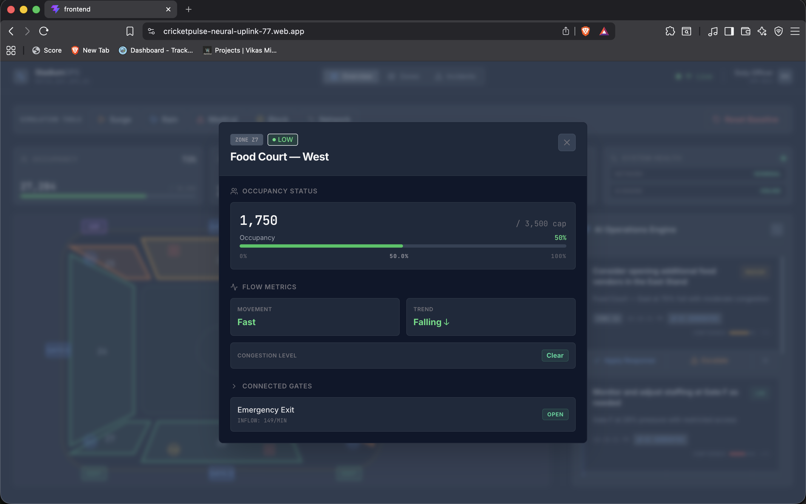
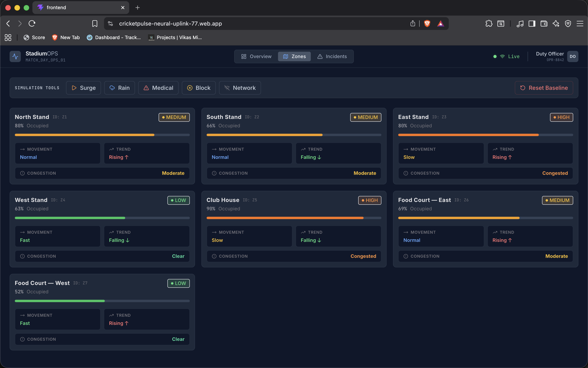
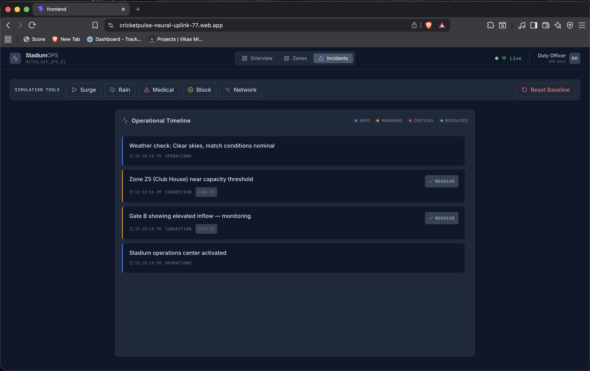
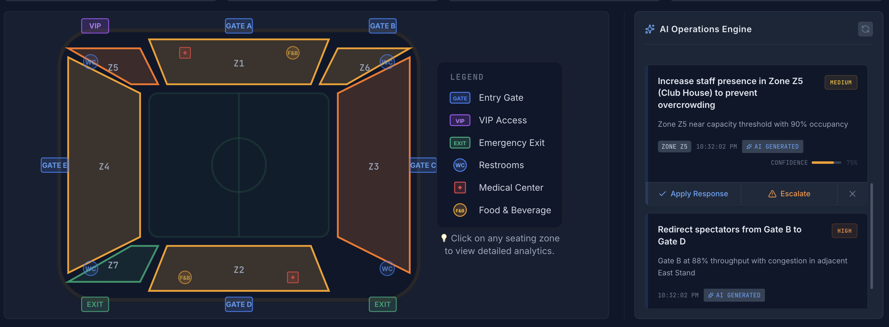
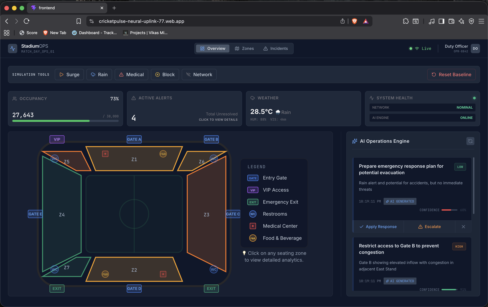
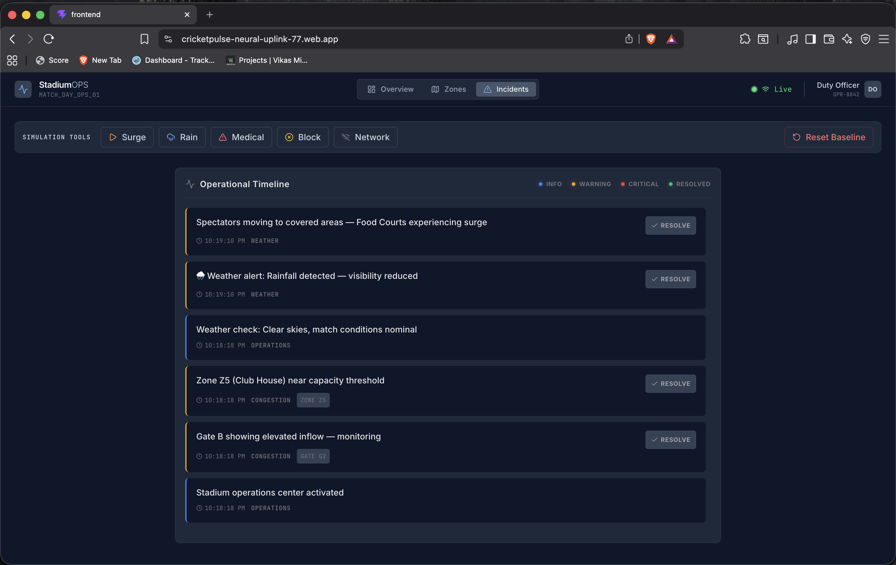

 > 🏆 **Top 15 Finalist — Google Agentic Premier League (Multicity, 2026)**  
> Built for Google Cloud's *"Build with AI – Agentic Premier League"* national hackathon.

# StadiumOPS — AI-Assisted Stadium Operations Platform

A real-time AI command platform for crowd coordination, congestion prediction, and emergency response during large-scale cricket matches. Combines LLM-powered operational intelligence with a deterministic fallback engine — designed to stay functional even when AI inference is unavailable.

---

## The Problem

Stadium operators at IPL-scale events (60,000+ capacity) have no unified real-time tooling. Gate congestion, crowd surges, weather incidents, and emergency dispatch are all coordinated manually — via walkie-talkies and instinct.

StadiumOPS gives operators a single command center: live zone status, AI-generated action recommendations, and a fallback system that keeps working when the AI doesn't.

---

## Why This Matters

Cricket is one of the most attended sports across India and the Asia-Pacific region, with major matches regularly attracting tens of thousands of spectators.

Managing crowd movement, gate congestion, incident response and operational visibility at this scale remains a complex challenge. Stadium operators often rely on fragmented systems and manual coordination, making it difficult to maintain situational awareness during rapidly evolving situations.

StadiumOPS explores how AI-assisted operational intelligence can help operators detect risks earlier, coordinate responses faster and make more informed decisions during large-scale sporting events while keeping humans in control of final actions.

---

## Architecture

```
┌──────────────────────────────────────────────────────────────┐
│                  FRONTEND (React 18 + Vite)                  │
│                                                              │
│   ┌─────────────────┐  ┌──────────────────┐  ┌───────────┐   │
│   │ Command         │  │ Stadium SVG Map  │  │ Alert     │   │
│   │ Dashboard       │  │ (live zone risk  │  │ Feed +    │   │
│   │                 │  │  coloring)       │  │ Actions   │   │
│   └────────┬────────┘  └──────────────────┘  └───────────┘   │
│            │  useStatus hook — polls every 4 seconds         │
└────────────┼─────────────────────────────────────────────────┘
             │
             ▼
┌──────────────────────────────────────────────────────────────┐
│               BACKEND (FastAPI + Uvicorn)                    │
│                                                              │
│  ┌─────────────────────────────────────────────────────┐     │
│  │           Operational State                         │     │
│  │   in-memory singleton → swappable to Redis/Firestore│     │
│  └──────────────────┬──────────────────────────────────┘     │
│                     │                                        │
│     ┌───────────────┼──────────────────┐                     │
│     ▼               ▼                  ▼                     │
│  ┌──────────┐  ┌──────────────┐  ┌───────────────────────┐   │
│  │Simulation│  │  AI Layer    │  │  Fallback Rules Engine│   │
│  │ Engine   │  │  Groq API    │  │  (deterministic)      │   │
│  │          │  │  LLaMA 3     │  │  activates when AI    │   │
│  └──────────┘  └───────┬──────┘  │  is unavailable       │   │
│                        │         └───────────────────────┘   │
└────────────────────────┼─────────────────────────────────────┘
                         │
                         ▼
                  ┌──────────────┐
                  │   Groq API   │
                  │  (LLaMA 3,   │
                  │  ~200ms p50) │
                  └──────────────┘
```

**Key design principle:** The system has two parallel decision engines — the LLM and the rules engine. The LLM provides context-aware recommendations; the rules engine provides guaranteed operational output. They don't compete — the rules engine only activates when the LLM is unavailable.

---

## Features

- **Real-time Command Dashboard** — Live zone status and crowd density on a dynamic SVG stadium map with risk-based color coding (green → amber → red)
- **AI Operational Recommendations** — Groq (LLaMA 3) processes the full operational state and returns structured JSON recommendations for operator action
- **Deterministic Fallback Engine** — Rules-based system activates automatically if AI inference fails — the system never goes dark during operations
- **Scenario Simulation Engine** — Backend endpoints to trigger realistic events (congestion, weather, network failures) for training and demo purposes
- **Production-Grade UI** — Dark mode command-center interface built with React 18 + TypeScript + TailwindCSS 3

---

## Human-in-the-Loop Design

StadiumOPS was intentionally designed as an AI-assisted system rather than an AI-autonomous system.

The AI layer analyzes operational conditions and provides recommendations, reasoning and confidence scores. However, final decisions always remain with human operators.

This design principle is especially important in safety-critical environments where accountability, context and human judgment remain essential.

To further improve reliability, StadiumOPS includes a deterministic fallback engine that continues providing operational guidance even when AI inference is unavailable.

---

## Tech Stack

| Layer | Technology | Why |
|---|---|---|
| Frontend | React 18 + TypeScript + Vite | Type safety, fast dev loop |
| UI | TailwindCSS 3 + custom SVG | Dynamic risk-zone coloring on stadium map |
| Backend | FastAPI + Pydantic + Uvicorn | Async Python, automatic schema validation on LLM output |
| AI Inference | Groq API (LLaMA 3) | ~200ms p50 latency — fast enough for real-time ops |
| State | In-memory singleton | Hackathon simplicity; architecture supports Redis/Firestore swap |
| Deployment | Stateless — Cloud Run ready | No sticky sessions required |

---

## Google Cloud Technologies Used

StadiumOPS was built during the Google Cloud Agentic Premier League and leverages Google Cloud technologies for cloud-native deployment and application infrastructure.

### Technologies Used

- Google Cloud Run
- Firebase
- Google Cloud ecosystem
- React + TypeScript
- FastAPI
- Groq API
- LLaMA 3

The project was designed as a cloud-native application with stateless backend services that can be deployed and scaled using Google Cloud infrastructure.

---

## Engineering Decisions

**Why polling instead of WebSockets?**  
In a hackathon demo environment with unpredictable network conditions, WebSocket connections create fragile demos. A 4-second polling interval gives near-real-time feedback while tolerating network blips. In production, this would migrate to Server-Sent Events or WebSockets.

**Why a fallback rules engine alongside the LLM?**  
An AI-only system fails silently. Stadium operations can't tolerate a black box — if the AI is unavailable, operators still need actionable guidance. The rules engine ensures graceful degradation rather than total failure. During the final demo, the AI inference hiccupped once. The fallback activated. Nobody noticed.

**Why Groq + LLaMA 3 instead of OpenAI?**  
Groq's inference latency (~200ms for LLaMA 3 70B) is significantly faster than GPT-4 at equivalent load. For a real-time operational dashboard, recommendation latency matters — operators can't wait 3 seconds for a response.

**Why structured JSON output from the LLM via Pydantic?**  
Prompting the LLM to return structured JSON that maps directly to UI components removes a parsing layer and makes AI output type-safe via Pydantic models. If the LLM returns malformed JSON, Pydantic validation fails fast — triggering the fallback engine rather than crashing silently.

---

## Getting Started

### Backend (FastAPI)

```bash
cd backend
python -m venv venv
source venv/bin/activate
pip install -r requirements.txt

cp .env.example .env
# Set GROQ_API_KEY in .env

uvicorn app.main:app --reload --port 8000
```

API docs: `http://localhost:8000/docs`

### Frontend (React + Vite)

```bash
cd frontend
npm install
npm run dev
```

Dashboard: `http://localhost:5173`

---

## Project Context

Built during the **Google Agentic Premier League (Multicity)**, where participants were challenged to solve real-world operational problems using AI-powered systems. StadiumOPS reached **Top 15** out of participants across all city qualifiers.

The hackathon theme: build an AI agent that solves a genuine operational problem in real time. Stadium operations were chosen for their scale, real stakes (crowd safety), and absence of any good existing tooling.

---

## Impact

StadiumOPS demonstrates how AI can be used as an operational decision-support system for large-scale public events.

By combining real-time telemetry, AI-generated recommendations, and deterministic fallback mechanisms, the platform helps operators:

- Identify operational risks earlier
- Improve situational awareness
- Coordinate responses more effectively
- Maintain resilience during system failures

While built as a hackathon prototype, the concepts explored in StadiumOPS can extend beyond sports venues to concerts, festivals, transportation hubs, and other large public gatherings.

---
## Screenshots

### Operations Overview Dashboard

Real-time command center displaying occupancy, active alerts, weather conditions, system health, live stadium map, and AI-generated operational recommendations.



---

### Zone Monitoring & Analytics

Operators can drill into individual stadium zones to view occupancy, congestion levels, flow trends, and connected infrastructure.

#### North Stand (Z1)



#### Food Court West (Z7)



---

### Multi-Zone Monitoring

View operational status across all stadium zones simultaneously to identify emerging congestion risks and monitor crowd movement patterns.



---

### Incident Management Timeline

Centralized incident feed showing operational alerts, congestion events, weather incidents, and resolution workflows.



---

### AI-Assisted Recommendations

The AI Operations Engine analyzes current stadium conditions and generates structured recommendations with reasoning and confidence indicators.



---

### Crisis Simulation

Operators can simulate operational scenarios such as weather disruptions, crowd surges, medical emergencies, network failures, and access restrictions.

#### Rain Scenario



#### Rain Generated Incidents



---

## Post-Hackathon Roadmap

- [ ] Swap in-memory state for Redis (enable horizontal scaling)
- [ ] Replace polling with Server-Sent Events
- [ ] Deploy production grade multi-region infrastructure
- [ ] Add historical incident logging to BigQuery
- [ ] Multi-stadium support with tenant isolation

---

## Author

**Kiruthick B** — [GitHub](https://github.com/Kiruthick7) · [LinkedIn](https://linkedin.com/in/kiruthick)
